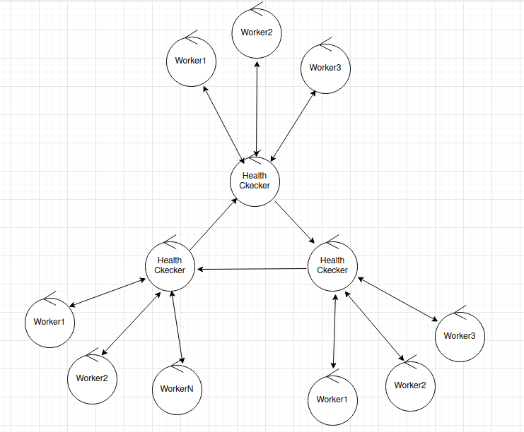
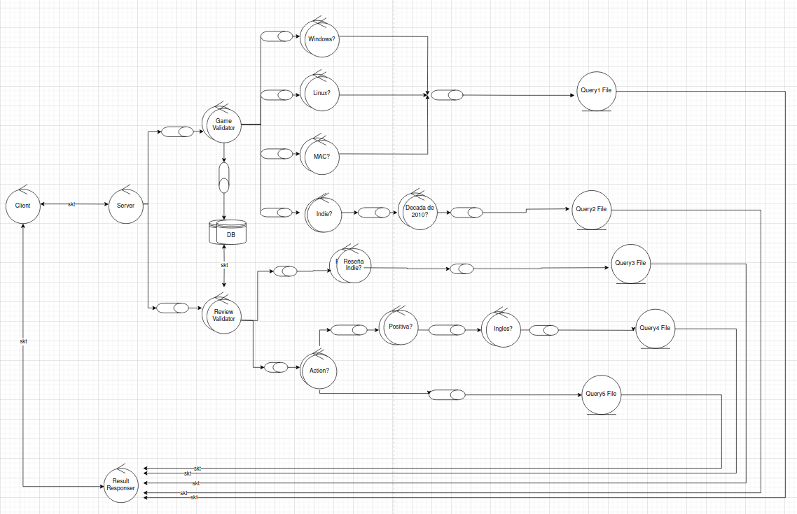
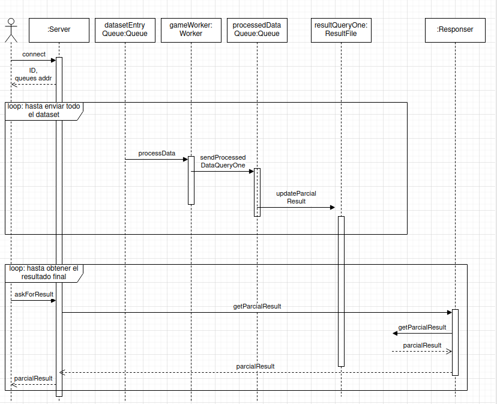
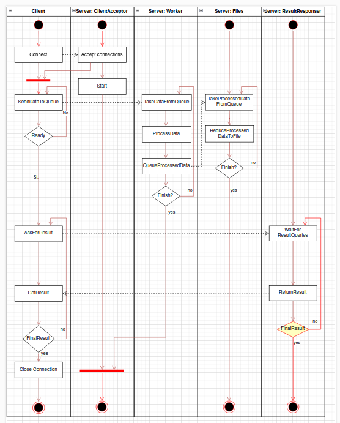

# Sistemas Distribuidos I - Tolerancia a Fallos

---

**Alumnos**

- Castellano Tomas, 100835 
- Couttulenc Marcos, 106381 
- Bursztyn Fernando,100898

## Introduccion

Se solicita un sistema distribuido que analice los reviews de juegos y reseñas de la plataforma de videojuegos Steam a distintos títulos publicados. El cliente le transmitirá al server dos datasets distintos. El primero consta de un dataset de juegos de Steam, el cual contiene información de los juegos tal como su ID, nombre, género, cantidad de horas promedio jugadas históricamente, plataformas soportadas, fecha de publicación, entre otras. El segundo consta de un dataset de reseñas de juegos de Steam, el cual contiene el ID del juego al que corresponde la reseña (el cual hace match con el ID del primer dataset), y la reseña en sí.

Se deben obtener las siguientes Querys:

1. Cantidad de juegos soportados en cada plataforma (Windows, Linux, MAC)
2. Nombre de los juegos top 10 del género "Indie" publicados en la década
del 2010 con más tiempo promedio histórico de juego
3. Nombre de los juegos top 5 del género "Indie" con más reseñas positivas
4. Nombre de juegos del género "action" con más de 5.000 reseñas negativas
en idioma inglés
5. Nombre de juegos del género "action" dentro del percentil 90 en cantidad
de reseñas negativas

A medida que el server recibe la información de los datasets de parte del cliente, irá procesando la misma, elaborando un “resultado parcial”. El cliente puede consultar por el mismo en el momento que quiera.

Al finalizar el procesamiento de toda la información, el servidor le comunica al cliente el resultado final.

# Actualizaciones en el sistema

Para este trabajo práctico, hemos hecho las siguientes actualizaciones en el sistema para que el mismo sea tolerante a fallos, y su performance en tiempo no se vea afectada.

## Health Checkers

Se implementaron procesos llamados Health Checkers, los cuales tienen como propósito "levantar" a los containers que se caigan del sistema. Cuando el sistema se levanta, se le asigna a cada container un Health Checker correspondiente, y, apenas se levante el container, debe notificarle mediante un socket TCP el nombre de su container. Con el mismo, el HealthChecker puede levantarlo en caso de que se caiga. La manera de proceder del HealthChecker es: guardar el nombre de los containers que debe cuidar en un archivo, y mantener una comunicación via socket con los mismos para verificar que no esten caídos. En caso de que el HealthChecker se caiga y se vuelva a levantar, chequea que los containers guardados en el archivo estén activos, y si no lo están, los levanta

Finalmente, entre los HealthCheckers se conectan formando un anillo, y se cuidan entre ellos también. En caso que el container que se caiga sea un Health Checker, el Health Checker que le corresponde cuidarlo lo levantará.

## Filtro de duplicados por Worker

Si un Worker se cae luego de enviar hacia adelante un mensaje pero antes de realizarle el ACK al anterior, cuando el Worker caído se levante de nuevo, recibirá el mismo mensaje de nuevo, y lo volverá a enviar hacia adelante. De esta manera, se pueden generar duplicados en nuestro sistema. Se implementó un filtro de duplicados en cada Worker. El mismo guarda en disco el ID del último mensaje recibido por cada Worker en el nivel anterior. Cuando recibe un nuevo mensaje, verifica que no sea un duplicado de ese Worker, y si no lo es, lo envía hacia adelante, actualiza el estado del disco, y realiza el ACK.

## Eliminación de los Reducer Workers

En la versión previa del sistema, antes de que los mensajes lleguen a los Query File Workers, existían los Reducer Workers, que se encargaban, como dice su nombre, de realizar un Reduce de una cantidad determinada de mensajes, para que los Query Files no reciban un mensaje por cada registro del dataset. Como en la nueva versión del sistema no se pueden mantener datos en memoria, ya que se perderían si el container se cae, se tomó la decisión de eliminar estos Workers, y que el trabajo de reducir varios mensajes lo hagan directamente los Query Files de una manera determinada (sistema de logging) para que no se pierdan en caso de caída de container.A

## Sistema de Logging en los Query Files

Para reducir la cantidad de veces de accesos a discos en los Query Files, se implementó un sistema de Logging de mensajes a disco basado en un sistema de log de transacciones a una base de datos. Cuando llega un nuevo mensaje, el mismo no se impacta directamente en el archivo de resultados, sino que se impacta en un archivo de logging, mucho mas chico que el anterior. Cuando este archivo almacene una cierta cantidad de transacciones, se impactarán todas juntas en el archivo de resultados. De esta manera se ahorra una gran cantidad de veces de abrir y escribir un archivo pesado en disco.

## Mensajeria por Batch

El cambio mas significativo en términos de performance. En la versión anterior del sistema, el cliente enviaba los juegos y reseñas por batch al servidor, pero este los separaba en casos individuales, y propagaba la información al resto del sistema en mensajes que contenian UN juego o UNA review. En la nueva versión, se maneja una mensajería por batch en la totalidad del sistema, reduciendo significativamente la cantidad de mensajes que viajan a través de las queues de todo el sistema, evitando saturaciones en las mismas. Con esta mejora, se logró que los tiempos de corridas que tardaban decenas de minutos se reduzcan a segundos.

# Vista Física 

## Diagrama de Robustez

Un diagrama de robustez es una herramienta visual utilizada en el desarrollo de software, para modelar la estructura y el comportamiento de un sistema. Sirve como puente entre los requisitos funcionales (capturados en los casos de uso) y el diseño de la solución.

Agregamos tambien un pequeño diagrama acerca del funcioamiento de los Health Checker. Cada worker del sistema se conecta aleatoriamente a alguno de estos, con fin de soportar caidas de los mismos. Cuando un worker se cae por alguna razon, el health checker asociado es el responsable de levantarlo para que vuelva a procesar sigueinte

# Vista de Desarrollo

## Diagrama de paquetes.

Es un tipo de diagrama estructural utilizado en el Lenguaje de Modelado Unificado (UML) que sirve para organizar y visualizar la estructura de un sistema de software.

# Vista de procesos.

## Diagrama de secuencia 

Es una representación gráfica que muestra cómo interactúan un conjunto de objetos en un sistema a lo largo del tiempo. Es como una "película" que muestra paso a paso cómo se desarrollan las acciones en un proceso.

## Diagrama de actividades

 es una representación gráfica que muestra el flujo de actividades dentro de un proceso. A diferencia de los diagramas de secuencia, que se centran en las interacciones entre objetos, los diagramas de actividades se enfocan en el flujo general de trabajo desde un inicio hasta un fin.

